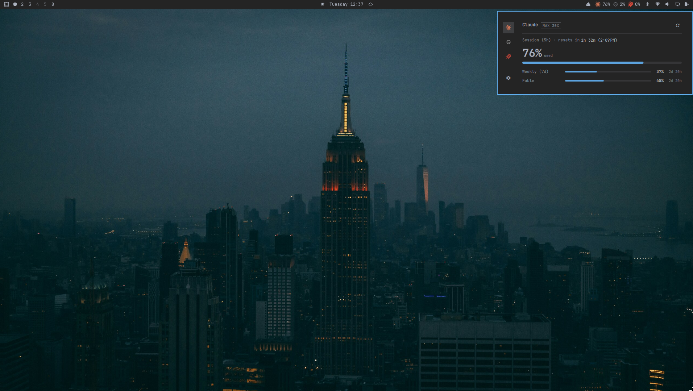
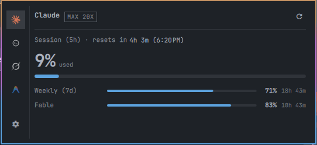
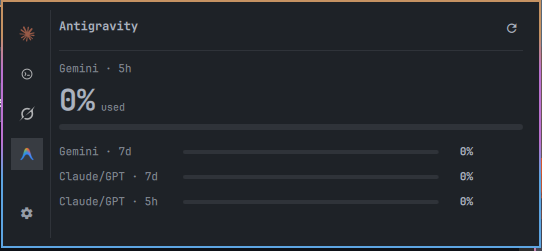

# Agent Bar

Agent Bar shows your AI quota in the Omarchy bar. Each enabled provider
gets a chip with a percentage, and clicking a chip opens a popup with
every usage window and the time left until the next reset. A fresh install
shows Claude and Codex. Grok and Antigravity can be turned on in
Settings.


## Install

You need Omarchy with Quickshell (Quattro) on Linux x86_64, plus the CLI
of each provider you want to watch.

```bash
omarchy plugin add https://github.com/othavi0/omarchy-agent-bar.git
```

When you enable the plugin, Omarchy asks which bar section gets the
widget. If you skip the question, it goes to the right section. To move it
later:

```bash
omarchy bar move othavi0.agent-bar --section center
```

## What you see



Each chip shows used or remaining percentage, whichever you pick in
Settings. The popup shows the plan tag (`MAX 20X`, for example), the lead
window with its countdown and reset time, and one row per other window.




| Chip state | Meaning |
| --- | --- |
| Dimmed | The provider CLI is not installed. Click to see the install page. |
| `!` | Usage is past the critical threshold. |
| `—` | The provider is connected but reports no percentage window. |

If a refresh fails, the chip keeps the last good reading and the popup
shows when it was taken. When a provider needs login or setup, the popup
offers the matching action.

When Claude has a banked usage reset available, its popup section gets a
"Resets" row with a `Use reset` action; confirming claims it and refreshes
the provider.

| Action | Result |
| --- | --- |
| Left click | Open or close the popup |
| Middle click | Refresh all providers now |
| Right click | Open Settings |

Agent Bar reads the local data your provider CLIs already keep. It does
not install CLIs, touch credentials, or show money.

## Settings

Right click any chip to enable, disable, and reorder providers, switch
between used and remaining, set the refresh interval (60 seconds by
default), and toggle notifications. The file is
`~/.config/agent-bar/settings.json`.

## Update

Settings tells you when a new version is out. Click
`Update to <version>`, confirm, and then click `Restart shell` to load the
new version.

You can also update from a terminal:

```bash
omarchy plugin update othavi0.agent-bar --yes && omarchy-restart-shell
```

If Settings shows a migration notice, your copy predates the git install.
Reinstall it:

```bash
omarchy plugin remove othavi0.agent-bar
omarchy plugin add https://github.com/othavi0/omarchy-agent-bar.git
```

Settings, cache, and backups live outside the plugin directory and survive
the reinstall.

## Remove

```bash
omarchy plugin remove othavi0.agent-bar
```

Settings also has a Remove button.

> [!IMPORTANT]
> **Agent Bar installs an update only when you click it.** It never
> updates on a schedule, and it installs whatever `master` holds at that
> moment.
>
> Versions 10.3.22 and older never loaded on Omarchy 4.0.3. The chips show
> `···`, the popup stays on its loading placeholder, and Settings says
> "Update check failed". Run the update command once to move to a current
> release.

## Development

This repository is both the plugin tree and its source. CI builds and
commits `bin/agent-bar` and `bundle.json`, so don't edit them by hand. See
[Contributing](CONTRIBUTING.md), [Architecture](docs/dev/architecture.md),
[Releasing](docs/dev/releasing.md), and
[Troubleshooting](docs/guide/troubleshooting.md).

## License

MIT. See [LICENSE](LICENSE).
