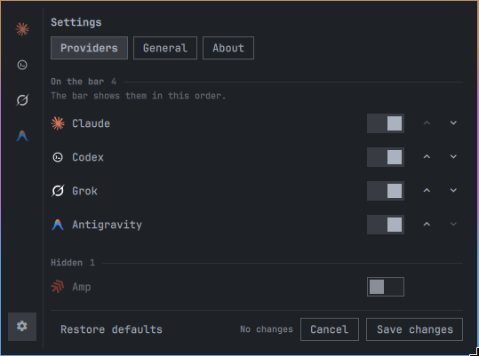

# Agent Bar

Agent Bar puts your AI quota in the Omarchy bar. One chip per provider
(Claude, Codex, Amp, Grok, Antigravity), a popup with every usage window,
and a countdown to the next reset.



## What you see

Each enabled provider gets a chip with its icon and a percentage, used or
remaining, whichever you prefer. Click it and the popup opens with the
plan tag (`MAX 20X`, for example), a lead window showing both the
countdown and the wall-clock reset, and every other window as a row with
its own usage track.

Windows are normalized across providers, so Claude's `Session (5h)`,
`Weekly (7d)` and per-model windows look the same as Codex's. A chip
shows `!` past the critical threshold. If a refresh fails, the last good
reading stays on the bar and the popup says when it was taken. A provider
that is connected but reports no percentage window shows `—`.

When a provider needs something from you, the popup offers one safe
action: open the login in a terminal, show install guidance, or retry.
The whole thing follows your Omarchy theme and works from the keyboard.

| Action | Result |
| --- | --- |
| Left click | Open the popup; click again to close |
| Middle click | Refresh all providers now |
| Right click | Open Settings |

Agent Bar reads the local data your provider CLIs already keep. It does
not install CLIs, touch credentials, or show money. Percentages and reset
times, nothing else.

## Install

You need Omarchy with Quickshell (Quattro) on Linux x86_64, plus the
provider CLIs you want to watch. `git` ships with Omarchy, so there is
nothing else to install.

```bash
omarchy plugin add https://github.com/othavi0/omarchy-agent-bar.git
```

Omarchy asks where to put the widget when you enable the plugin. Skip the
question and it lands in the right section of the bar. The install is one
directory:

```text
~/.config/omarchy/plugins/othavi0.agent-bar/
```

## Update

```bash
omarchy plugin update othavi0.agent-bar
```

Installed before this release, as a plain directory instead of a git
checkout? The update button shows a one-time migration notice. Run:

```bash
omarchy plugin remove othavi0.agent-bar
omarchy plugin add https://github.com/othavi0/omarchy-agent-bar.git
```

Settings, cache and backups live outside the plugin directory and survive
the swap.

## Remove

```bash
omarchy plugin remove othavi0.agent-bar
```

Update and remove are also buttons in Settings.

## Settings

Right click any chip. You can enable, disable and reorder providers,
switch between used and remaining, set the refresh interval (60 seconds
by default) and toggle notifications. The file is
`~/.config/agent-bar/settings.json`.

Every product merge cuts a release, so the update check in Settings
always offers the latest version.

## Development

This repository is the plugin tree and its source in one place. See
[Architecture](docs/dev/architecture.md), [Releasing](docs/dev/releasing.md)
and [Contributing](CONTRIBUTING.md) for build, test and release.

CI commits `bin/agent-bar` and `bundle.json`. Don't edit them by hand.

## More

- [Troubleshooting](docs/guide/troubleshooting.md)
- [Documentation index](docs/README.md)
- [Architecture](docs/dev/architecture.md)
- [Contributing](CONTRIBUTING.md)

## License

MIT. See [LICENSE](LICENSE).
